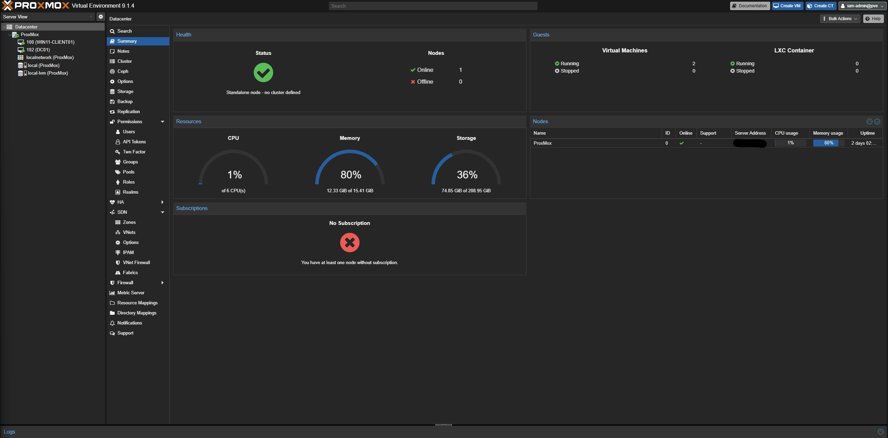
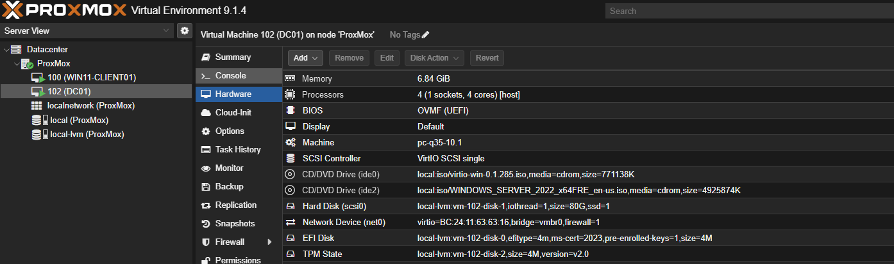
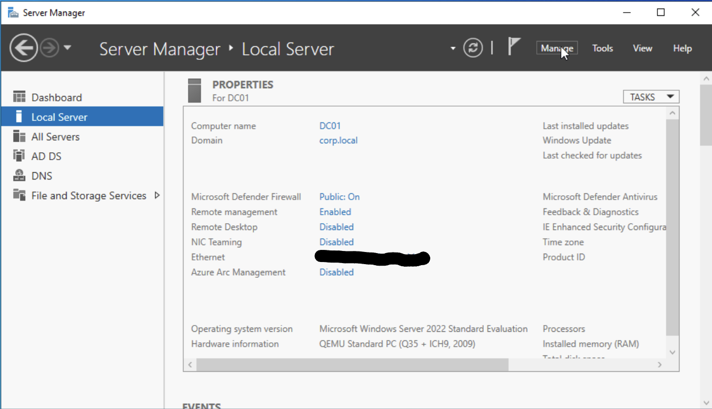
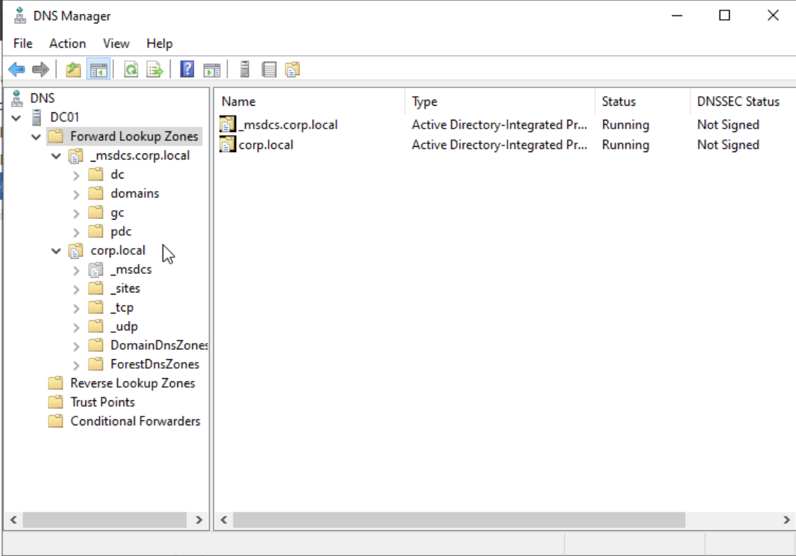
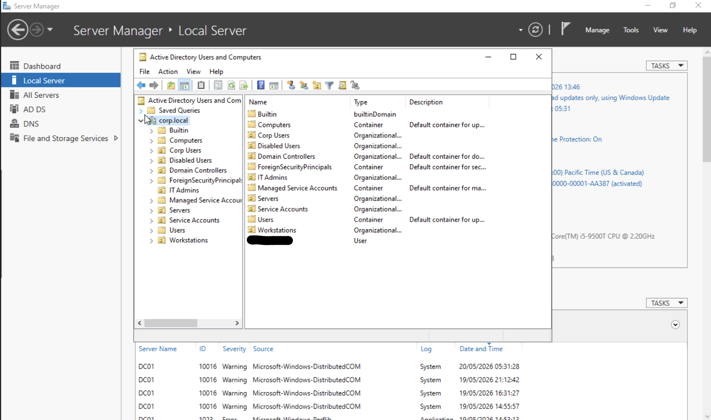
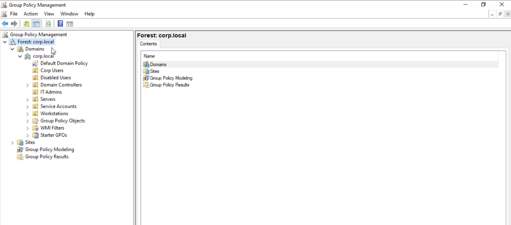

# Enterprise IAM Lab

## Overview

This repository documents the build and progression of my enterprise Identity & Access Management (IAM) lab environment.

The project is focused on developing practical, hands-on experience with:

- Virtualisation
- Windows Server administration
- Active Directory
- Group Policy Management
- DNS infrastructure
- Identity and Access Management concepts
- Hybrid identity architecture
- Enterprise systems administration

---

# Technologies Used

## Infrastructure
- Proxmox VE
- Virtual Machines
- Virtual Hardware Configuration

## Microsoft Technologies
- Windows Server 2022
- Active Directory Domain Services (AD DS)
- DNS
- Group Policy Management

## IAM Concepts
- Organisational Units (OUs)
- Role-Based Access Concepts
- Identity Segmentation
- Administrative Separation
- Enterprise Identity Structure

## Planned Technologies
- Microsoft Azure
- Microsoft Entra ID
- MFA
- Conditional Access
- PowerShell Automation
- RBAC
- Hybrid Identity Integration

---

# Current Lab Environment

| Component | Status |
|---|---|
| Proxmox Hypervisor | Complete |
| Windows Server 2022 | Complete |
| Domain Controller (DC01) | Complete |
| Active Directory | Complete |
| DNS Configuration | Complete |
| OU Structure | Complete |
| Group Policy Management | Complete |
| Azure / Entra ID | Planned |
| MFA | Planned |
| PowerShell Automation | Planned |

---

# Screenshots

## Proxmox Infrastructure

### Proxmox Dashboard

### DC01 VM Hardware Configuration

---

## Windows Server

### DC01 Server Manager

### Active Directory DNS Configuration

---

## Active Directory

### OU Structure

### Group Policy Management

---

# Project Goals

The objective of this lab is to build practical enterprise IAM and infrastructure experience through hands-on deployment, administration, troubleshooting, and documentation.

This environment will continue expanding into hybrid identity and cloud IAM technologies including Microsoft Entra ID, Azure integration, MFA, RBAC, and automation.

---

# Learning Outcomes

Through this lab I am developing practical experience with:

- Enterprise infrastructure deployment
- Active Directory administration
- Identity management concepts
- DNS and Group Policy configuration
- Virtualisation technologies
- Systems troubleshooting
- IAM architecture fundamentals
- Enterprise operational workflows

---

# Future Roadmap

## Phase 1 — Infrastructure & Active Directory
- [x] Proxmox deployment
- [x] Windows Server deployment
- [x] Domain Controller configuration
- [x] Active Directory setup
- [x] DNS configuration
- [x] Group Policy Management

## Phase 2 — Identity Administration
- [ ] User provisioning
- [ ] Group management
- [ ] RBAC implementation
- [ ] Domain joined client machines

## Phase 3 — Cloud Identity
- [ ] Microsoft Azure integration
- [ ] Microsoft Entra ID
- [ ] Hybrid identity sync
- [ ] Conditional Access
- [ ] MFA implementation

## Phase 4 — Automation & Security
- [ ] PowerShell automation
- [ ] IAM workflows
- [ ] Security hardening
- [ ] Identity governance concepts# enterprise-iam-lab
Hands-on enterprise IAM lab focused on Active Directory, Azure/Entra ID, RBAC, MFA, and hybrid identity architecture.
